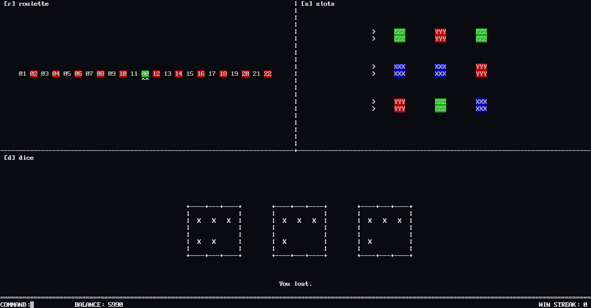

# C++ Casino



## Games

 - Roulette (Red, Black, Green).
 - Slots, three in a row wins.
 - Dice (Even, Odd, Three of a kind, Above 12, Below 10).


## Prerequisites

```
ncurses, c++ compiler (>= g++ v7.1.0)
```

To get ncruses on Ubuntu, execute the following command:

```
sudo apt-get install libncurses-dev
```

## Installing

```
make
```

> You can change the compiler at the top of the makefile

