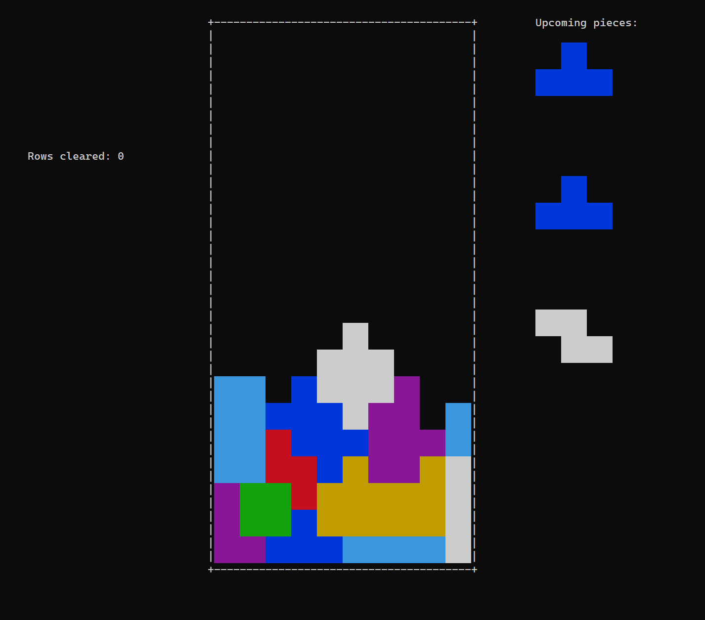

# tetris

A text-based user interface (TUI) Tetris implementation in C++.




## Building

#### Dependencies:
- `ncurses` in order to render to the terminal.
- a terminal (emulator) capable of rendering colors.

`ncurses` can be installed on Ubuntu with the following command:
```
sudo apt-get install libncurses5-dev
```

To compile use:
```
make
```

To run tetris you can use the executable produced in `build/tetris`, or run the following command, which also compiles the executable:
```
make run
```

## Instructions

* <kbd>a</kbd> and <kbd>d</kbd>: Move the current tetromino
* <kbd>s</kbd>: Soft drop the tetromino
* <kbd>w</kbd>: Rotate the tetromino clockwise
* <kbd>c</kbd>: Rotate the tetromino counter clockwise

* <kbd>q</kbd>: Exits the game
* <kbd>p</kbd>: Pause the game (same key to resume)

## Not yet implemented

- Score
- Levels (different speed depending on how many rows have been cleared)
- Super Rotation System (SRS) implementation
- Wall kick